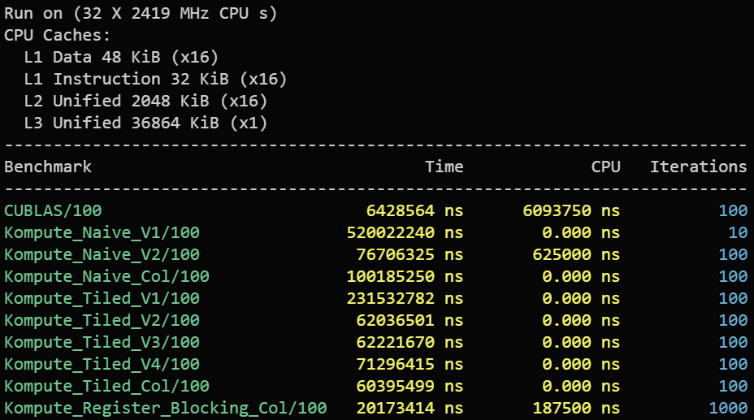

# KomputeBench (WIP)
Benchmarking CUDA and Vulkan Compute shader performance in various applications.

Vulkan compute shaders are abstracted using the [`Kompute`](https://github.com/KomputeProject/kompute) framework.
Current implementation compares basic *`GE`neral `M`atrix `M`ultiplication(GEMM)* operations on the GPU.

## Requirements:
- CMake 3.28+
- C++20 Compiler
- CUDA SDK installed (12.2+ recommended, but tested with 12.6) + supported Nvidia GPU
- [`Vulkan SDK`](https://vulkan.lunarg.com/) installed.

## Building
Create `.env.cmake` from `.env.cmake.template`, modifying as needed. Dependencies are managed using CMake's FetchContent.

```bash
cmake -B build -S .

# For Benchmarks, building in release mode is recommended
cmake --build build --config Release


# or for single config generators
cmake -B build -S . -DCMAKE_BUILD_TYPE=Release
cmake --build build
```

## Running benchmarks
The benchmark executables have "benchmark" in their name.
```bash
# for example
./sgemm_benchmark
```

## Results

### cuBLAS vs Kompute naive vs Kompute GEMM Tiling in Local Memory
<!--  -->


<br> <br>
*Two 4096x4096 32bit `float` matrix multiplication on an RTX 4080 12GB mobile GPU.* 

### Discussion

* Fastest Naive implementation is about 0.12x of cuBLAS performance.
* Fastest Tiling Implementation is about 0.1x of cuBLAS performance.
* 2D register blocking achieves about 0.35x of cuBLAS performance.

There are still various optimizations that can be done to improve performance.

### GEMM methods to be implemented:
- [x] Tiling in local memory.
- [ ] Wider data-types.
- [ ] Transposed input matrix.
- [ ] More work per thread.
- [ ] Wider loads with register blocking.
- [X] 2D register blocking.

## Todo
- [ ] Compare cuBLAS sgemm against Kompute using various GEMMs methods.
- [ ] Try half precision cuBLAS hgemms vs Kompute HGEMMs - Using Vulkan half floats.
- [ ] Create Kompute Operations for these methods to ease use.

## References
* [`Matrix multiplication in WebGL2-compute`](https://www.ibiblio.org/e-notes/webgl/gpu/mul/sgemm.htm)

* [`How to Optimize a GEMM`](https://github.com/tpoisonooo/how-to-optimize-gemm/) -  Optimized Row major matrix multiplication using Vulkan 
